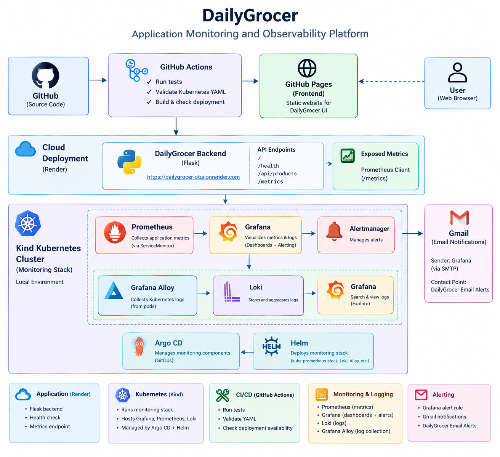

# DailyGrocer – Monitoring and Observability Platform

[](https://github.com/mounika-gutha/dailygrocer/actions/workflows/ci.yml)



## Highlights

- Flask-based grocery store application
- GitHub Actions CI pipeline
- Backend deployed on Render
- Prometheus application metrics
- Grafana monitoring dashboard
- Application availability monitoring
- Grafana email alerting
- Loki centralized logging
- Grafana Alloy log collection
- Kubernetes-based monitoring environment
- Argo CD for monitoring stack management

## Architecture

```text
                         GitHub
                           |
             +-------------+-------------+
             |                           |
      GitHub Actions                 GitHub Pages
             |                           |
          CI Tests                    Frontend
             |
             v
       Render Backend
             |
             | /metrics
             v
        Prometheus
             |
             v
          Grafana
        /         \
   Dashboard     Alerts
                    |
                    v
                 Gmail

Kubernetes / Kind
       |
       +-- Prometheus
       +-- Grafana
       +-- Alertmanager
       +-- Loki
       +-- Grafana Alloy
       +-- Argo CD
Main Components
Component	Purpose
Flask	Backend application
GitHub	Source code management
GitHub Actions	CI and availability checks
Render	Backend hosting
Prometheus	Metrics collection
Grafana	Monitoring dashboards and alerting
Loki	Centralized log storage
Grafana Alloy	Kubernetes log collection
Kubernetes / Kind	Monitoring environment
Argo CD	GitOps management
Gmail SMTP	Email notifications
Project Screenshots
Grafana Dashboard

Prometheus Targets

Loki Logs

Prometheus Alert

GitHub Actions

Project Overview

DailyGrocer is a grocery store web application with a monitoring and observability platform.

The project demonstrates how a deployed application can be monitored using Prometheus and Grafana, while application logs are collected using Grafana Alloy and stored in Loki.

GitHub Actions is used for continuous integration and application availability checks.

Project Workflow
Developer
    |
    v
GitHub Repository
    |
    v
GitHub Actions
    |
    +---- Run Tests
    |
    +---- Availability Check
    |
    v
Render
    |
    v
DailyGrocer Flask API
    |
    +---- /health
    |
    +---- /metrics
    |
    v
Prometheus
    |
    v
Grafana
    |
    +---- Dashboard
    |
    +---- Alert
    |
    v
Gmail Notification

Kubernetes Logs
    |
    v
Grafana Alloy
    |
    v
Loki
    |
    v
Grafana Explore
Technologies Used
Python
Flask
Git
GitHub
GitHub Actions
Render
Docker
Kubernetes
Kind
Helm
Argo CD
Prometheus
Grafana
Loki
Grafana Alloy
Gmail SMTP
Project Structure
dailygrocer/
│
├── backend/
│   ├── app.py
│   └── data/
│       └── products.json
│
├── frontend/
│
├── tests/
│
├── .github/
│   └── workflows/
│       ├── ci.yml
│       ├── deployment-check.yml
│       └── availability.yml
│
├── docs/
│   ├── images/
│   │   └── dailygrocer-architecture.png
│   └── ss/
│       ├── grafana-dashboard.png
│       ├── prometheus-targets.png
│       ├── loki-logs.png
│       ├── prometheus-alert.png
│       └── github-actions.png
│
├── requirements.txt
└── README.md
Testing

GitHub Actions automatically installs the project dependencies and runs the Python tests.

The CI workflow runs on:

Push to main
Pull requests to main
Application Monitoring

The Flask backend exposes Prometheus metrics through:

/metrics

The application records:

Total HTTP requests
HTTP response status
Request latency
Application availability

Prometheus collects these metrics from the deployed Render application.

Grafana Dashboard

The Grafana dashboard monitors:

Total requests
Average request latency
Request rate
HTTP 5xx errors
Application availability

The dashboard helps identify application failures and performance problems.

Centralized Logging

Grafana Alloy discovers Kubernetes pods and collects their logs.

The logs are forwarded to Loki.

Kubernetes Pods
      |
      v
Grafana Alloy
      |
      v
Loki
      |
      v
Grafana Explore

Example LogQL query:

{namespace=~".+"} |= "DailyGrocer"
Alerting

Grafana contains an application availability alert:

DailyGrocer Application Down

The alert checks:

up{instance=~".*dailygrocer.*"}

If the application is unavailable for the configured pending period, Grafana sends an email notification through Gmail SMTP.

Running the Monitoring Environment

The monitoring environment uses a local Kubernetes Kind cluster.

Main components:

Prometheus
Grafana
Alertmanager
Loki
Grafana Alloy
Argo CD

Prometheus and Grafana are installed using the kube-prometheus-stack Helm chart managed through Argo CD.

Loki is managed through Argo CD and Grafana Alloy collects Kubernetes logs.

Open Grafana

Start the Grafana port-forward:

kubectl port-forward -n monitoring svc/kube-prometheus-stack-local-grafana 3000:80

Open:

http://localhost:3000

Login:

Username: admin
Password: admin123
Open Prometheus

Start the Prometheus port-forward:

kubectl port-forward -n monitoring svc/kube-prometheus-stack-loca-prometheus 9090:9090

Open:

http://localhost:9090
Check Deployed Application

DailyGrocer backend:

https://dailygrocer-otui.onrender.com

Health endpoint:

https://dailygrocer-otui.onrender.com/health

Metrics endpoint:

https://dailygrocer-otui.onrender.com/metrics

Learning Outcomes

This project helped demonstrate:

Git and GitHub workflow
GitHub Actions CI/CD
Flask backend deployment
Application health monitoring
Prometheus metrics
Grafana dashboards
Grafana alerting
Gmail SMTP notifications
Kubernetes monitoring
Loki centralized logging
Grafana Alloy
Argo CD
GitOps-based monitoring configuration
Troubleshooting monitoring infrastructure
Future Improvements
Persistent Grafana storage
Persistent Loki storage
Additional application alerts
More detailed monitoring dashboards
Production Kubernetes deployment
Author

Gutha Mounika

B.Tech CSE – Artificial Intelligence and Machine Learning

GitHub: https://github.com/mounika-gutha

License

This project is for learning and portfolio purposes.
