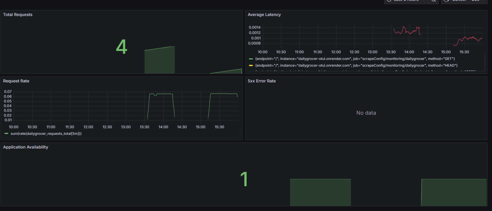
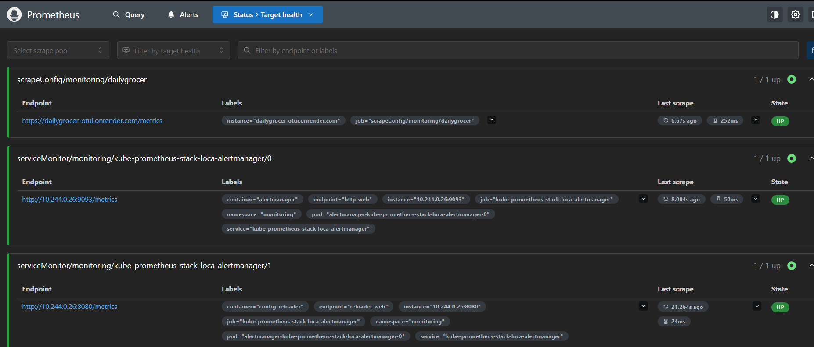
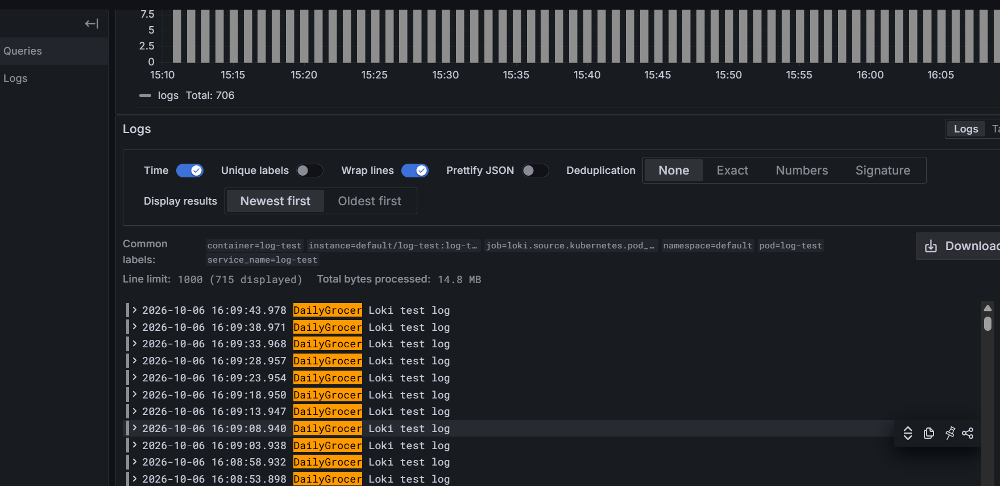
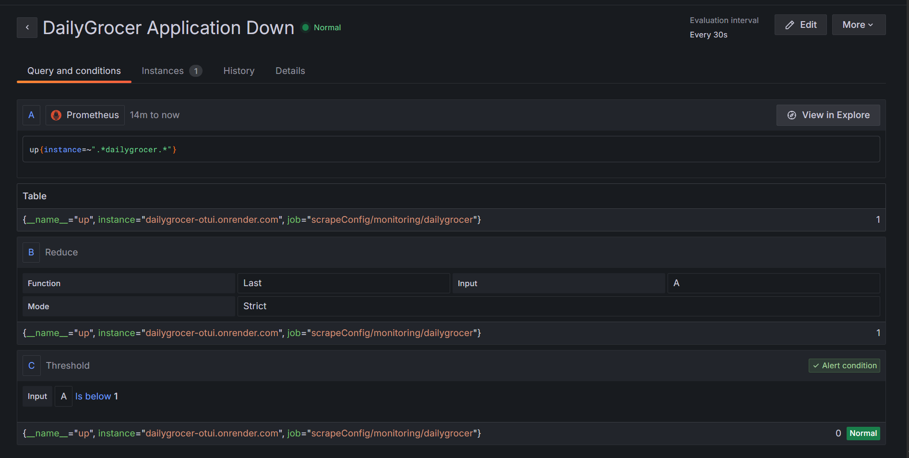
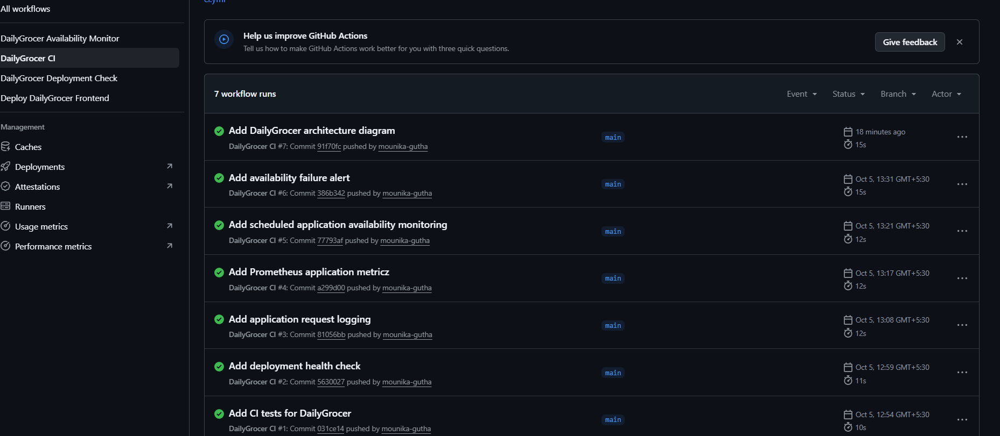

Yes. From now on, when I give you a README, I’ll give you the **entire README in one single Markdown code block**, with no separate code blocks inside it.

```markdown
# DailyGrocer – Monitoring and Observability Platform

[](https://github.com/mounika-gutha/dailygrocer/actions/workflows/ci.yml)

A DevOps-based monitoring and observability project built around a Flask grocery application.

This project focuses on application deployment, CI automation, monitoring, centralized logging, alerting, and GitOps using **Prometheus, Grafana, Loki, Grafana Alloy, Alertmanager, Helm, Kind, Argo CD, and GitHub Actions**.

### 🌟 Highlights

- 🚀 Deployed a Flask-based grocery application on Render.
- 🔄 Implemented GitHub Actions for automated testing and CI.
- ❤️ Added a health-check endpoint to monitor application availability.
- 📊 Exposed application metrics and monitored them using Prometheus.
- 📈 Created a Grafana dashboard to monitor application performance.
- 📝 Collected Kubernetes logs using Grafana Alloy and stored them in Loki.
- 🔎 Used Grafana Explore to search and analyze centralized logs.
- 🚨 Configured Grafana alerting for application availability issues.
- 📧 Configured Gmail email notifications for monitoring alerts.
- ⚙️ Used Helm to deploy and manage monitoring components.
- ☸️ Used Kind to run the Kubernetes monitoring environment locally.
- 🔄 Used Argo CD for GitOps-based Kubernetes application management.

### 🏗️ Architecture

The project uses a DevOps monitoring and observability architecture.


### Main Components

| Component | Purpose |
|---|---|
| Flask | Grocery application backend |
| GitHub | Source code management |
| GitHub Actions | CI and automated testing |
| Render | Application deployment |
| Kubernetes (Kind) | Local monitoring environment |
| Prometheus | Collects application metrics |
| Grafana | Visualizes metrics, logs, and alerts |
| Loki | Stores and manages logs |
| Grafana Alloy | Collects Kubernetes logs |
| Alertmanager | Manages monitoring alerts |
| Helm | Deploys monitoring components |
| Argo CD | GitOps and Kubernetes application management |
| Gmail SMTP | Sends email notifications |

## 📸 Project Screenshots

### 📊 Grafana Dashboard

The Grafana dashboard displays DailyGrocer application metrics such as request count, request rate, request latency, 5xx error rate, and application availability.



### 🎯 Prometheus Targets

Prometheus monitors the DailyGrocer application and collects metrics from the `/metrics` endpoint.



### 📝 Centralized Logs with Loki

Grafana Alloy collects Kubernetes logs and sends them to Loki.

The logs can be searched and viewed through Grafana Explore.



### 🚨 Grafana Alerting

The project includes an application availability alert.

If the DailyGrocer application becomes unavailable, Grafana generates an alert and sends an email notification.



### ⚙️ GitHub Actions CI

GitHub Actions is used to automatically install dependencies and run application tests whenever changes are pushed to the repository.



### ℹ️ Project Overview

I developed this project to gain practical experience with DevOps, application monitoring, centralized logging, alerting, Kubernetes, and GitOps.

The project starts with a Flask-based grocery application. The application is deployed on Render and provides APIs for the grocery application.

A health endpoint is used to check application availability.

The application also exposes a `/metrics` endpoint. Prometheus collects these metrics and Grafana is used to visualize them through a monitoring dashboard.

For centralized logging, Grafana Alloy collects Kubernetes pod logs and forwards them to Loki. Grafana connects to Loki so that logs can be searched and analyzed using Grafana Explore.

Grafana alerting is configured to identify application availability problems and send email notifications through Gmail SMTP.

A local Kubernetes environment using Kind is used for the monitoring and logging components. Helm is used to deploy the monitoring stack and Loki.

Argo CD is used to manage Kubernetes applications using a GitOps approach.

GitHub Actions is used to automate application testing whenever changes are pushed or pull requests are created.

### 🔄 Project Workflow

#### 1. Application Development

The DailyGrocer application is developed using Flask.

The backend provides the following main endpoints:

- `/` – Checks whether the application is running.
- `/health` – Checks application health.
- `/api/products` – Returns grocery products.
- `/metrics` – Provides Prometheus metrics.

#### 2. CI Automation

GitHub Actions is used for Continuous Integration.

The CI pipeline:

- Checks out the source code.
- Sets up Python.
- Installs application dependencies.
- Installs pytest.
- Runs application tests.

The main test command is:

`python -m pytest`

The CI workflow runs when changes are pushed to the `main` branch or when a pull request is created.

#### 3. Application Deployment

The Flask backend is deployed on Render.

The deployed application is available at:

`https://dailygrocer-otui.onrender.com`

The application uses the `/health` endpoint to verify that the backend is running correctly.

The application can be checked using:

`curl https://dailygrocer-otui.onrender.com/health`

Expected response:

`{"status": "healthy"}`

#### 4. Metrics Collection

The application exposes metrics through:

`/metrics`

Prometheus collects these metrics.

The main application metrics include:

- HTTP request count
- Request latency
- Request rate
- HTTP error rate
- Application availability

Example metrics:

`dailygrocer_requests_total`

`dailygrocer_request_latency_seconds`

The `up` metric is used to monitor application availability.

#### 5. Monitoring and Visualization

Grafana connects to Prometheus and displays the collected application metrics.

The DailyGrocer dashboard contains:

- Total Requests
- Average Latency
- Request Rate
- 5xx Error Rate
- Application Availability

These dashboards help understand the health and performance of the application.

#### 6. Centralized Logging

Grafana Alloy collects logs from Kubernetes pods.

The logs are forwarded to Loki.

The logging flow is:

`Kubernetes Pods → Grafana Alloy → Loki → Grafana`

Loki provides centralized log storage.

The logs can be searched and analyzed through Grafana Explore.

Example LogQL query:

`{namespace=~".+"} |= "DailyGrocer"`

#### 7. Alert Management

Grafana is configured with an application availability alert.

The alert checks:

`up{instance=~".*dailygrocer.*"}`

The alert condition is:

`A < 1`

The alert evaluates the application availability regularly.

If the application becomes unavailable, an alert is generated.

#### 8. Email Notifications

Grafana is configured with Gmail SMTP.

The contact point is:

`DailyGrocer Email Alerts`

When the application availability alert is triggered, Grafana sends an email notification.

The email notification setup was tested successfully.

#### 9. Kubernetes Monitoring Environment

Kind is used to run a local Kubernetes cluster.

The monitoring environment contains components such as:

- Prometheus
- Grafana
- Alertmanager
- Loki
- Grafana Alloy

Kubernetes is used to manage the monitoring and logging components.

#### 10. Helm

Helm is used to install and manage Kubernetes monitoring components.

The project uses the `kube-prometheus-stack` for:

- Prometheus
- Grafana
- Alertmanager
- Node Exporter
- Kubernetes monitoring

Loki is also deployed using Helm.

#### 11. GitOps with Argo CD

Argo CD is used to manage Kubernetes applications using GitOps.

The basic workflow is:

`Git / Configuration → Argo CD → Kubernetes Cluster`

Argo CD keeps the Kubernetes environment aligned with the desired configuration.

### 🛠️ Technologies Used

- Python
- Flask
- Git
- GitHub
- GitHub Actions
- Render
- Kubernetes
- Kind
- Helm
- Prometheus
- Grafana
- Loki
- Grafana Alloy
- Alertmanager
- Argo CD
- Gmail SMTP
- Linux / Ubuntu WSL

### 📁 Project Structure

dailygrocer/
│
├── backend/
│   ├── app.py
│   └── data/
│       └── products.json
│
├── frontend/
│
├── tests/
│
├── .github/
│   └── workflows/
│       ├── ci.yml
│       ├── deployment-check.yml
│       └── availability.yml
│
├── docs/
│   ├── images/
│   │   └── dailygrocer-architecture.png
│   │
│   └── ss/
│       ├── grafana-dashboard.png
│       ├── prometheus-targets.png
│       ├── loki-logs.png
│       ├── prometheus-alert.png
│       └── github-actions.png
│
├── requirements.txt
│
└── README.md

### 🧪 Testing

The project includes application tests and automated CI validation.

The tests verify the application endpoints and application behavior.

The main test command is:

`python -m pytest`

GitHub Actions automatically runs the tests as part of the CI pipeline.

### 🔍 Application Monitoring

Prometheus monitors the application through the metrics endpoint.

The main metrics used for monitoring are:

- `dailygrocer_requests_total`
- `dailygrocer_request_latency_seconds`
- `up`

These metrics are visualized in Grafana.

The dashboard helps monitor:

- Number of requests
- Request rate
- Request latency
- 5xx errors
- Application availability

### 📝 Centralized Logging

The logging architecture is:

`Kubernetes Pods → Grafana Alloy → Loki → Grafana Explore`

This allows application and Kubernetes logs to be collected and searched from one place.

### 🚨 Alerting

The project includes an application availability alert.

The alert checks:

`up{instance=~".*dailygrocer.*"}`

If the application is unavailable, Grafana generates an alert.

The alert notification is sent through Gmail SMTP.

### ▶️ Running the Monitoring Environment

Start Docker Desktop first.

Check the Kind cluster:

`kind get clusters`

Check Kubernetes nodes:

`kubectl get nodes`

Check monitoring pods:

`kubectl get pods -n monitoring`

Check logging pods:

`kubectl get pods -n logging`

Check Argo CD applications:

`kubectl get applications -n argocd`

### 📊 Open Grafana

Run:

`kubectl port-forward -n monitoring svc/kube-prometheus-stack-local-grafana 3000:80`

Open:

`http://localhost:3000`

Grafana credentials:

- Username: `admin`
- Password: `admin123`

### 🔎 Open Prometheus

Run:

`kubectl port-forward -n monitoring svc/kube-prometheus-stack-loca-prometheus 9090:9090`

Open:

`http://localhost:9090`

### 🌐 Check the Deployed Application

Check the home endpoint:

`curl https://dailygrocer-otui.onrender.com/`

Check the health endpoint:

`curl https://dailygrocer-otui.onrender.com/health`

Check the metrics endpoint:

`curl https://dailygrocer-otui.onrender.com/metrics`

### 📚 Learning Outcomes

Through this project, I gained practical experience in:

- Deploying a Flask application.
- Using Git and GitHub.
- Creating CI pipelines using GitHub Actions.
- Running automated application tests.
- Deploying an application using Render.
- Creating application health checks.
- Monitoring applications using Prometheus.
- Creating dashboards using Grafana.
- Monitoring application availability.
- Creating Grafana alerts.
- Configuring Gmail email notifications.
- Running Kubernetes using Kind.
- Using Helm for Kubernetes deployments.
- Collecting logs using Grafana Alloy.
- Storing logs using Loki.
- Searching logs using Grafana Explore.
- Managing Kubernetes applications using Argo CD.
- Understanding GitOps.
- Understanding application observability.

### 🚀 Future Improvements

- Add more application-level alerting rules.
- Add persistent storage for monitoring data.
- Add more Grafana dashboards.
- Improve application performance monitoring.
- Add more centralized logging features.
- Add automated deployment stages to GitHub Actions.
- Add more Kubernetes monitoring.
- Add additional notification channels.

### 👩‍💻 Author

**Mounika Gutha**

B.Tech Computer Science Engineering

Specialization: Artificial Intelligence and Machine Learning

Interested in DevOps, MLOps, Kubernetes, CI/CD, monitoring, and cloud technologies.

### 📄 License

This project was created for learning and practical experience in DevOps, application monitoring, centralized logging, alerting, Kubernetes, and GitOps practices.
```

